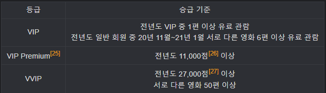
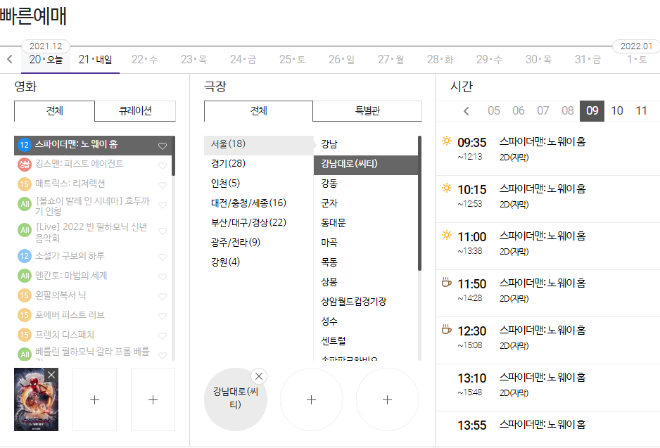
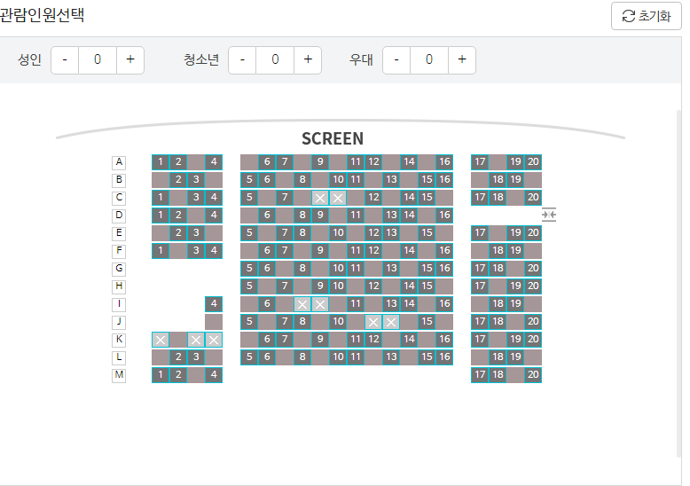
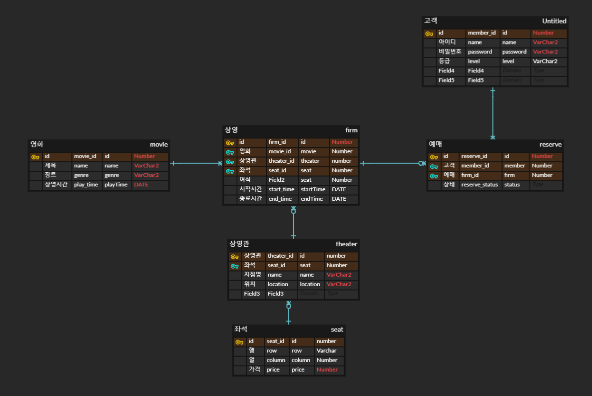

# 영화 예매 프로그램
* 기한 : 2021.12.20 ~ 2021.12.22

## 기술스택
* JAVA
* ORACLE DB
* JDBC

## 주요 기능
### 관리자
* 영화 등록
  * 제목
  * 가격
  * 장르
* 상영일자 및 여석 등록
  * 여석 조정 가능(ex: 코로나 악화로 인한 여석 줄이기)

### 고객
#### 고객 정보
  * 아이디 + 비밀번호
  * 영화 예매 횟수에 따른 등급 부여 (메가박스의 정책을 참조)

#### 영화 예매
* 기본적인 예매방식 : 날짜 서택 -> 영화 선택 -> 극장 선택 -> 상영시간 선택 -> 인원 선택

* 할인정책: 영화의 상영시간(조조, 야간) or 특정일(ex: 문화가 있는 날) 등 
* 결제선택: 카드, 상품권 등이 있으나 일단은 카드로 통일(추후 추가 예정)
* 결제
* 예매 완료 후 예매번호 부여
  
* **(선택)** 좌석의 배치표를 보여주고 선택하는 기능 추가 (좌석은 고정이기 때문에 괜찮을것 같음.)
  * 좌석선택 시 특정 위치나 특정 좌석 타입에 따라 가격 차등부여

    
#### 예매 내역
  * 예매 내역 조회
  * 예매 취소
    * 상영시간까지 5시간을 기준으로 예매 취소 정책 부여
      * 5시간보다 많이 남음: 온라인 취소 가능
      * 5시간보다 적게 남음: 현장에서 취소

### 추가기능 (박스오피스)
* [영화진흥위원회](https://www.kobis.or.kr/kobisopenapi/homepg/apiservice/searchServiceInfo.do)
  에서 제공하는 박스오피스API를 통해 일/월별 랭킹을 산정
* 가능하면 국내/국외 영화 랭킹 + 통합 랭킹을 출력

## ERD

